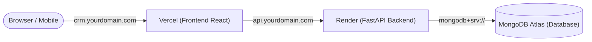

# 🚀 Nest Infra CRM — Cloud Deployment Guide

This guide details how to deploy **Nest Infra CRM** to the cloud using **MongoDB Atlas + Render (Backend) + Vercel (Frontend)** with custom domain configuration.

---

## 📋 Architecture Overview



---

## Step 1: Set up Cloud Database (MongoDB Atlas)

1. Sign up / Log in to [MongoDB Atlas](https://www.mongodb.com/cloud/atlas).
2. Click **Create a Deployment** ➔ Choose **M0 (Free Cluster)** ➔ Select your preferred region (e.g. `ap-south-1 Mumbai`).
3. Under **Security ➔ Database Access**:
   - Create a database user (e.g. `nest_admin`) with a secure password.
4. Under **Security ➔ Network Access**:
   - Click **Add IP Address** ➔ Choose **Allow Access from Anywhere (`0.0.0.0/0`)** so Render can connect.
5. Click **Connect** ➔ **Drivers (Python)** ➔ Copy the connection string:
   ```text
   mongodb+srv://nest_admin:<PASSWORD>@cluster0.abcde.mongodb.net/?retryWrites=true&w=majority
   ```

---

## Step 2: Push Code to GitHub

Open your terminal in this repository and run:
```bash
git add .
git commit -m "Production release with cloud configuration"
git push origin main
```

---

## Step 3: Deploy Backend on Render

1. Log in to [Render](https://render.com/).
2. Click **New +** ➔ **Web Service**.
3. Connect your GitHub repository: `nestinfradevelopers39-pixel/Backendcodecrm`.
4. Configure the Web Service:
   - **Name**: `nest-infra-crm-api`
   - **Root Directory**: `backend`
   - **Runtime**: `Python 3`
   - **Build Command**: `pip install -r requirements.txt`
   - **Start Command**: `uvicorn server:app --host 0.0.0.0 --port $PORT`
   - **Health Check Path**: `/api/health`
5. Under **Environment Variables**, add:
   | Key | Value |
   | :--- | :--- |
   | `MONGO_URL` | *Your MongoDB Atlas connection string from Step 1* |
   | `DB_NAME` | `nest_crm_production` |
   | `JWT_SECRET` | *(Click "Generate" or provide a 64-char random hex)* |
   | `ADMIN_EMAIL` | `nestinfradevelopers39@gmail.com` *(or your company email)* |
   | `ADMIN_PASSWORD` | `YourSecurePassword123!` |
   | `CORS_ORIGINS` | `https://crm.yourdomain.com,https://your-vercel-app.vercel.app` |
   | `ENVIRONMENT` | `production` |
6. Click **Create Web Service**.
7. Once deployed, note down your backend live URL: `https://nest-infra-crm-api.onrender.com`.

---

## Step 4: Deploy Frontend on Vercel

1. Log in to [Vercel](https://vercel.com/).
2. Click **Add New...** ➔ **Project** ➔ Import your repository.
3. In Project Configuration:
   - **Framework Preset**: `Create React App`
   - **Root Directory**: Click Edit ➔ select `frontend`.
4. In **Environment Variables**, add:
   | Key | Value |
   | :--- | :--- |
   | `REACT_APP_BACKEND_URL` | `https://nest-infra-crm-api.onrender.com` *(From Step 3)* |
5. Click **Deploy**.
6. Your CRM frontend is now live on `https://your-project.vercel.app`!

---

## Step 5: Connect Custom Domains (DNS)

To connect your own domain (e.g. `yourdomain.com`):

### 1. Frontend Domain (`crm.yourdomain.com`)
- In Vercel ➔ **Settings** ➔ **Domains** ➔ Add `crm.yourdomain.com`.
- In your DNS provider (Cloudflare / GoDaddy / Namecheap), add:
  - **Type**: `CNAME`
  - **Name / Host**: `crm`
  - **Target**: `cname.vercel-dns.com`

### 2. Backend Domain (`api.yourdomain.com`)
- In Render ➔ **Settings** ➔ **Custom Domains** ➔ Add `api.yourdomain.com`.
- In your DNS provider, add:
  - **Type**: `CNAME`
  - **Name / Host**: `api`
  - **Target**: *(Render DNS target provided in dashboard)*
- Update `CORS_ORIGINS` on Render to include `https://crm.yourdomain.com`.
- Update `REACT_APP_BACKEND_URL` on Vercel to `https://api.yourdomain.com` and redeploy.

---

## 🐳 Alternative: Self-Hosted on a VPS (Single Command)

If you prefer hosting on your own Ubuntu VPS (DigitalOcean, AWS EC2, Hetzner):

1. SSH into your VPS.
2. Install Docker & Docker Compose:
   ```bash
   curl -fsSL https://get.docker.com | sh
   ```
3. Clone repository and run:
   ```bash
   git clone https://github.com/nestinfradevelopers39-pixel/Backendcodecrm.git
   cd Backendcodecrm
   docker compose up -d --build
   ```
4. Everything (Frontend, Backend, and MongoDB) will run on port `3000`, `8000`, and `27017` automatically.
